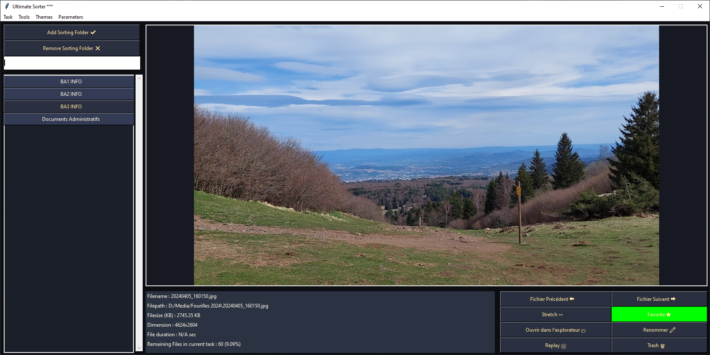

# Folderflow

## Description

FolderFlow is an intuitive file management system designed to streamline your workflow. With features that allow you to tag files as favorites, organize them into personalized folders, and save tasks for easy tracking, FolderFlow enhances your productivity. Get valuable insights on your files and manage them efficiently with an easy-to-use interface. Say goodbye to clutter and hello to organized, accessible files!

<p align="center">
  
  <br/>
  <strong>Folderflow in action.</strong>
</p>

## Features

- **File Management:** Visualize and sort your files by category for better organization.
- **Favorite Manager:** Keep track of your favorite files, marked with a star! [★]
- **Multiple Themes:** Choose from various themes, or easily create your own!
- **Viewer Mode:** Browse your files without sorting, perfect for quick access.
- **Sorting Task:** Create sorting tasks in YAML format, track your progress, and resume whenever you want!

## Usage

Make sure you have `Python >= 3.10` installed.


### Running Folderflow

1. Clone the repository:

   ```bash
   git clone https://github.com/Ant0in/FolderFlow.git
   ```

2. Navigate to the project directory:

   ```bash
   cd src/
   ```

3. Create a virtual environment and install dependencies:
   
   ```bash
   python -m venv .\venv
   .\venv\Scripts\activate
   ```

   ```bash
   pip install -r requirements.txt
   ```

4. Run Folderflow:

   ```bash
   python ./main.py
   ```

## How to use Folderflow

soon

## License

This project is licensed under the **MIT License**. You are free to use, modify, and distribute this software.


